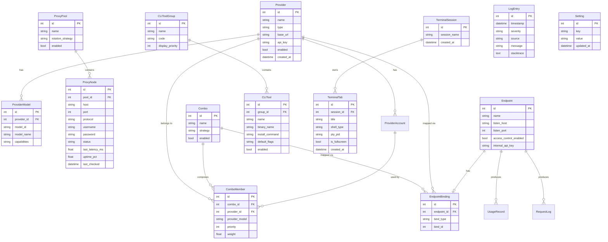

# Entity Relationship Diagram & Data Dictionary: aigate

**Versi:** 1.0
**Tanggal:** 2026-09-03
**Penulis:** System Analyst (stand-in)
**Sumber rujukan:** `documents/PRD.md` §2–§3, `docs/business/BRD.md`, `docs/analysis/FSD.md`
**Storage engine:** SQLite (via SQLAlchemy/peewee, lihat PRD §3 — Configuration Engine)

Dokumen ini memodelkan storage model untuk config engine aigate. Semua entitas disimpan di SQLite lokal; relasi mencerminkan kebutuhan routing, grouping CLI, dan sesi terminal.

---

## 1. Mermaid ER Diagram



    ProviderAccount {
        int id PK
        int provider_id FK
        string label
        string auth_type
        string api_key
        string oauth_token
        string refresh_token
        datetime expires_at
        bool enabled
    }

    UsageRecord {
        int id PK
        int endpoint_id FK
        int provider_id FK
        int account_id FK
        string model
        int tokens_in
        int tokens_out
        float cost_est
        datetime ts
    }

    RequestLog {
        int id PK
        int endpoint_id FK
        string model
        datetime ts
        int duration_ms
        text request
        text response
    }
```

---

## 2. Relasi (Ringkasan Kardinalitas)

| Relasi | Kardinalitas | Penjelasan |
| :--- | :--- | :--- |
| Provider → ProviderModel | 1:N | Satu provider punya banyak model ter-discover. |
| ProxyPool → ProxyNode | 1:N | Satu pool berisi banyak node proxy. |
| Provider → ComboMember | 1:N | Satu provider bisa jadi anggota banyak Combo. |
| Combo → ComboMember | 1:N | Satu Combo tersusun dari banyak anggota. |
| Combo → EndpointBinding | 1:N | Satu Combo dapat di-bind ke banyak endpoint. |
| Provider → EndpointBinding | 1:N | Satu Provider dapat di-bind ke banyak endpoint. |
| Endpoint → EndpointBinding | 1:1 (alternating) | Tiap endpoint terikat tepat satu sumber (provider atau combo). |
| CLIToolGroup → CLITool | 1:N | Satu grup berisi banyak tool CLI. |
| TerminalSession → TerminalTab | 1:N | Satu sesi terminal memiliki banyak tab. |
| Provider → ProviderAccount | 1:N | Satu provider punya banyak akun (multi-akun). |
| ProviderAccount → ComboMember | 1:N | Satu akun dapat dipakai sebagai anggota Combo (cadangan). |
| Endpoint → UsageRecord | 1:N | Tiap endpoint menghasilkan catatan pemakaian. |
| Endpoint → RequestLog | 1:N | Tiap endpoint menghasilkan log permintaan (debug). |

> Catatan: `EndpointBinding.bind_type` membedakan apakah `bind_id` menunjuk ke `Provider.id` atau `Combo.id` (polymorphic binding).

---

## 3. Data Dictionary

### Provider
Entitas penyimpan konfigurasi & kredensial AI provider.
- `id` (int, PK): identitas unik.
- `name` (string): nama provider (OpenAI, Anthropic, dst).
- `type` (string): kategori/format API provider.
- `base_url` (string): URL dasar API.
- `api_key` (string): API key (disimpan apa adanya, tanpa enkripsi — ADR-007; UI tidak me-redaksi).
- `enabled` (bool): status aktif.
- `created_at` (datetime): waktu pencatatan.

### ProviderModel
Model hasil auto-discovery per provider.
- `id` (int, PK)
- `provider_id` (int, FK → Provider)
- `model_id` (string): ID model (mis. `gpt-4o`).
- `model_name` (string): nama tampilan.
- `capabilities` (string): metadata fitur (chat/vision/dll).

### ProxyPool
Kumpulan proxy dengan strategi rotasi.
- `id` (int, PK)
- `name` (string)
- `rotation_strategy` (string): `round_robin` | `random` | `failover`.
- `enabled` (bool)

### ProxyNode
Satu node proxy dalam sebuah pool.
- `id` (int, PK)
- `pool_id` (int, FK → ProxyPool)
- `host` (string), `port` (int): alamat.
- `protocol` (string): `http` | `https` | `socks5`.
- `username`, `password` (string, opsional).
- `status` (string): `healthy` | `dead` | `unknown`.
- `last_latency_ms` (float): hasil health check terakhir.
- `uptime_pct` (float): persentase uptime.
- `last_checked` (datetime).

### Combo
Grup routing cerdas (fallback / load-balance / latency-cost).
- `id` (int, PK)
- `name` (string)
- `strategy` (string): `fallback` | `load_balance` | `latency_cost`.
- `enabled` (bool)

### ComboMember
Anggota provider/model dalam sebuah Combo.
- `id` (int, PK)
- `combo_id` (int, FK → Combo)
- `provider_id` (int, FK → Provider)
- `provider_model` (string): model spesifik di provider.
- `priority` (int): urutan fallback.
- `weight` (float): bobot load-balance.

### Endpoint
Server gateway lokal OpenAI-compatible.
- `id` (int, PK)
- `name` (string)
- `listen_host` (string), `listen_port` (int): alamat listen.
- `access_control_enabled` (bool)
- `internal_api_key` (string, opsional).

### EndpointBinding
Pemetaan endpoint → satu sumber (provider atau combo).
- `id` (int, PK)
- `endpoint_id` (int, FK → Endpoint)
- `bind_type` (string): `provider` | `combo`.
- `bind_id` (int): ID provider atau combo sesuai `bind_type`.

### CLIToolGroup
Grup kategori tool CLI (A/B/C).
- `id` (int, PK)
- `name` (string): nama grup.
- `code` (string): `A` | `B` | `C`.
- `display_priority` (int): urutan tampil (A diutamakan).

### CLITool
Satu preset tool CLI.
- `id` (int, PK)
- `group_id` (int, FK → CLIToolGroup)
- `name` (string): nama tool (mis. `aider`).
- `binary_name` (string): nama binary cek (`which`/`where`).
- `install_command` (string): perintah instal (`pip install ...`).
- `default_flags` (string): argumen default.
- `enabled` (bool)

### TerminalSession
Satu sesi terminal (workspace).
- `id` (int, PK)
- `session_name` (string)
- `created_at` (datetime)

### TerminalTab
Satu tab terminal dalam sesi.
- `id` (int, PK)
- `session_id` (int, FK → TerminalSession)
- `title` (string)
- `shell_type` (string): `bash` | `zsh` | `powershell` | `cmd`.
- `pty_pid` (string): referensi PTY backend.
- `is_fullscreen` (bool): state floating control.
- `created_at` (datetime)

### LogEntry
Log operasional aplikasi (PRD §2.8 / ADR-011). Semua method (frontend & backend)
wajib menulis log ke sini.
- `id` (int, PK)
- `timestamp` (datetime): waktu kejadian.
- `severity` (string): `info` | `warning` | `error`.
- `source` (string): asal log (modul/function, atau `frontend:<komponen>`).
- `message` (string): isi log.
- `stacktrace` (text, nullable): stacktrace / inner exception untuk warning & error.

### Setting
Penyimpanan seluruh konfigurasi aplikasi (PRD §2.8 / ADR-010). Menggantikan file
config terpisah; key-value store di SQLite.
- `id` (int, PK)
- `key` (string, unik): nama setting (mis. `default_port`, `dev_mode`, fitur toggle).
- `value` (string): nilai setting (serialisasi bebas).
- `updated_at` (datetime)

### ProviderAccount
Akun tambahan per provider (multi-akun) + kredensial OAuth.
- `id` (int, PK)
- `provider_id` (int, FK → Provider)
- `label` (string): nama akun (mis. `acc-1`).
- `auth_type` (string): `api_key` | `oauth`.
- `api_key` (string, opsional): kunci bila auth_type=api_key (plaintext per ADR-007).
- `oauth_token`, `refresh_token` (string, opsional): token OAuth.
- `expires_at` (datetime, opsional): kedaluwarsa token; dipakai untuk auto-refresh.
- `enabled` (bool)

### UsageRecord
Catatan pemakaian token & biaya per request (telemetri/kuota).
- `id` (int, PK)
- `endpoint_id` (int, FK → Endpoint)
- `provider_id` (int, FK → Provider)
- `account_id` (int, FK → ProviderAccount, opsional)
- `model` (string)
- `tokens_in`, `tokens_out` (int)
- `cost_est` (float): estimasi biaya.
- `ts` (datetime)

### RequestLog
Log permintaan (debug) level request/response.
- `id` (int, PK)
- `endpoint_id` (int, FK → Endpoint)
- `model` (string)
- `ts` (datetime)
- `duration_ms` (int)
- `request` (text): header/isi (opsional, mode debug).
- `response` (text): ringkasan jawaban.

---

## 4. Catatan Konsistensi dengan PRD/BRD
- Semua entitas tersimpan di SQLite (PRD §3).
- `EndpointBinding` mendukung polymorphic bind ke Provider/Combo (PRD §2.4).
- `ComboMember` mendukung priority + weight untuk strategi fallback/load-balance (PRD §2.3).
- `ProxyNode.status` + health check mengakomodasi US-2.2.3.
- `CLIToolGroup` (A/B/C) + `CLITool` mengakomodasi US-2.6.4 dan §2.6.1.
- `TerminalSession`/`TerminalTab` merefleksikan multi-tab + floating fullscreen (PRD §2.5).
- `LogEntry` merefleksikan mandatory logging (PRD §2.8 / ADR-011): seluruh method log ke sini, warning/error + stacktrace.
- `Setting` merefleksikan konfigurasi di DB (PRD §2.8 / ADR-010): tidak ada file config terpisah; secret tetap plaintext di kolom Provider/Endpoint/ProxyNode (ADR-007).
- `ProviderAccount` merefleksikan multi-akun + OAuth (PRD §2.1 / adopsi 9router): satu provider → banyak akun; token OAuth diperbarui otomatis.
- `UsageRecord` merefleksikan Pelacak Kuota & Pemakaian (PRD §2.4.2) + Usage Analytics (PRD §2.4.3).
- `RequestLog` merefleksikan Log Permintaan debug (PRD §2.4.3).
- Export/Import Setting (PRD §2.4.4) adalah serialisasi seluruh `Setting` + entitas di atas ke JSON (tanpa entitas baru).

---

*Dokumen ini ditulis di bawah scope `docs/analysis/` sesuai aturan specialist System Analyst.*
